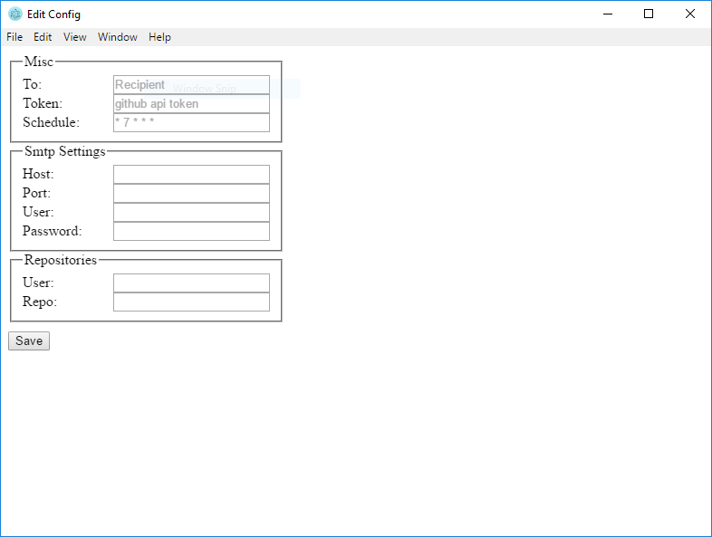

[](https://travis-ci.org/bookman25/github-feed)
[](https://coveralls.io/github/bookman25/github-feed?branch=master)

# github-feed

Used to create an rss like feed email to report status of monitored repositories.
It can do scheduled or on-demand emails.



```
yarn start
```

Run tests
```
yarn test
```

Package for install
```
Win:
yarn package --icon src/electron/rss.ico

Mac:
yarn package --icon src/electron/rss.icns
```